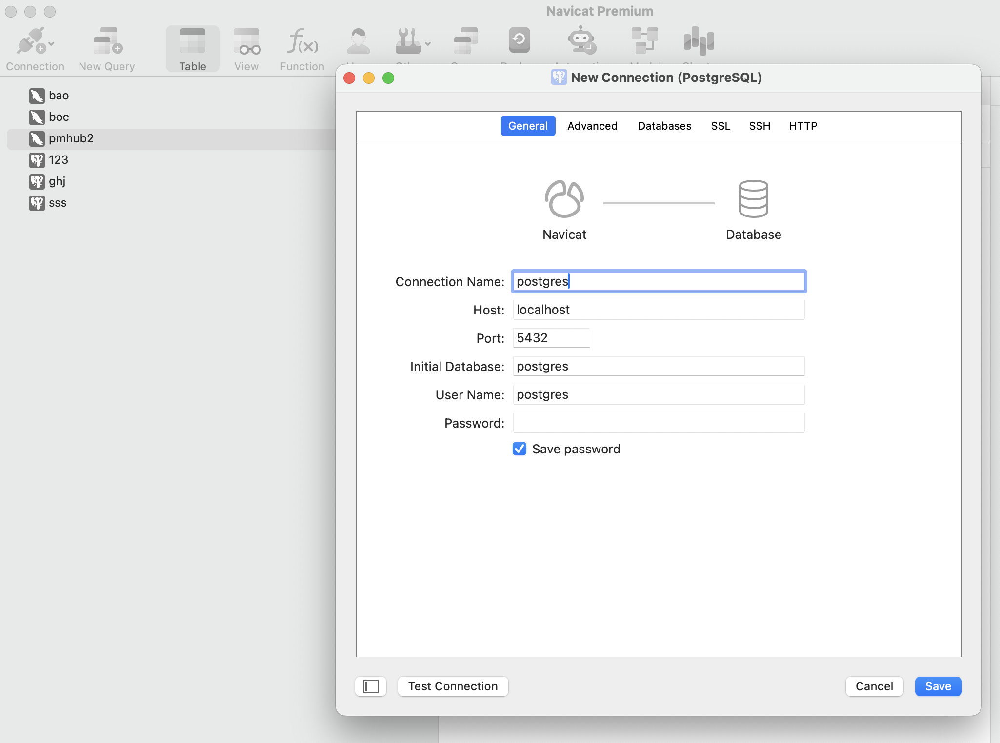
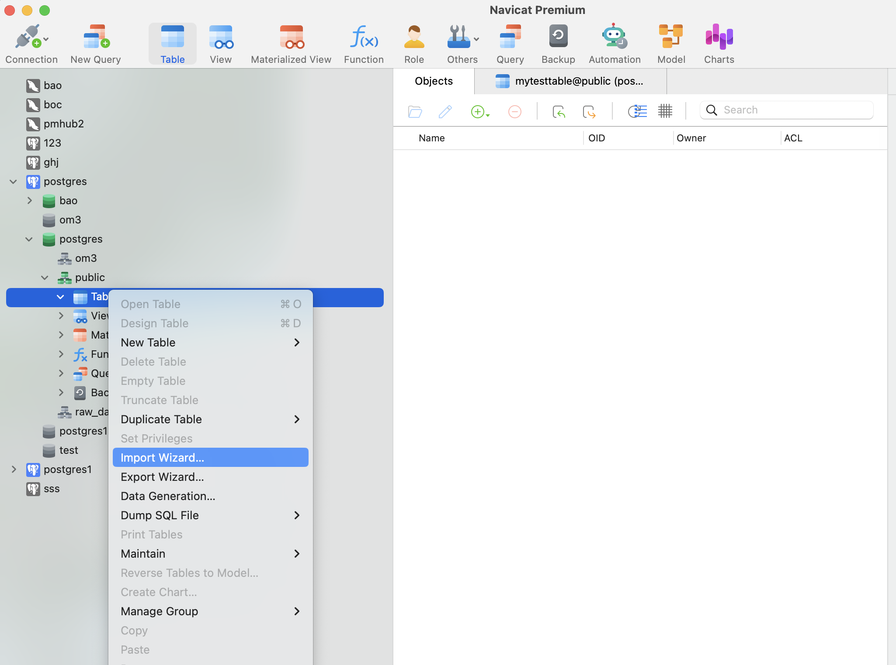
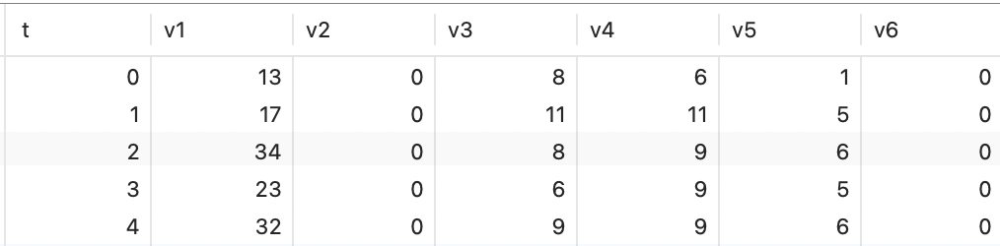

# VOCA System

## Project Setup
You can run voca-client and voca-server on your computer at the same time. 


### VOCA Client
```
1. cd voca-client
2. npm install
3. npm run serve
```

### VOCA Server
```
1. cd voca-server
2. npm install
3. configure your db information in the initdb/dbconfig.json file
4. npm run start
```

### Run VOCA

After starting the client and server, you can visit http://localhost:8081 in the browser. 

You can visit this [google doc](https://docs.google.com/document/d/1m2XpsjZgl6FHwlQK4e0V0yEHNjHLk6hpAQYcat0Fq-k/edit?usp=sharing) to view instructions for using the system.


### Enviroment
```
nodejs: v16.20.2
npm: 8.19.4
postgres: 14.12
```

### Database Initialization

We provide an example dataset, nycdata, that reflects the taxi activity in New York City. You can download from [Google Drive](https://drive.google.com/file/d/1Ab4erGIKN9NFXi8WhFHGy6XoaTH4kNKu/view?usp=sharing). We recommend using PostgreSQL for importing the database. 

#### Step 1: Import the Database
1、 Install PostgreSQL: If PostgreSQL is not already installed, download and install it from the [official website](https://www.postgresql.org/download/). We recommend using version 14.

2、 Import the Dataset: Use a graphical database tool such as Navicat or DBeaver to import the dataset into your local PostgreSQL database(Take Navicat for example):
(1) Create a postgres connection and database.

(2) Import the CSV file into the public directory.


3、Configure your db information in the initdb/dbconfig.json file：
   ```
   For example:
   "hostname":"127.0.0.1",
   "db":"postgres1",         //update to your dbname
   "username":"postgres",    //update to your username
   "password":"******",      //update to your password
```

#### Step 2: Encode the Data
Ensure Node.js is installed on your system. If not, download and install it from the  [official website](https://nodejs.org/en/download). We recommend using version 16.

1、 Navigate to the Directory: Open your terminal and go to the /voca-server/initdb directory:
```
cd /voca-server/initdb  
```

2、 Run the Encoding Script: Execute the encode_bigarray_ave.js script to encode the data. This will generate the corresponding coefficient file in the database:
```
nodejs encode_bigarray_ave.js 
```

You can also use your own dataset instead of nycdata. Ensure your data follows a similar format:
```
t (A single t column)
v1
v2
v3 
... (Multiple v columns)
```
For example, this is the first five rows of a dataset with 1 time column and 6 value columns.



